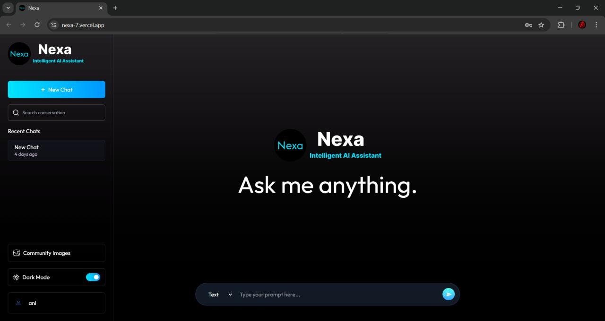
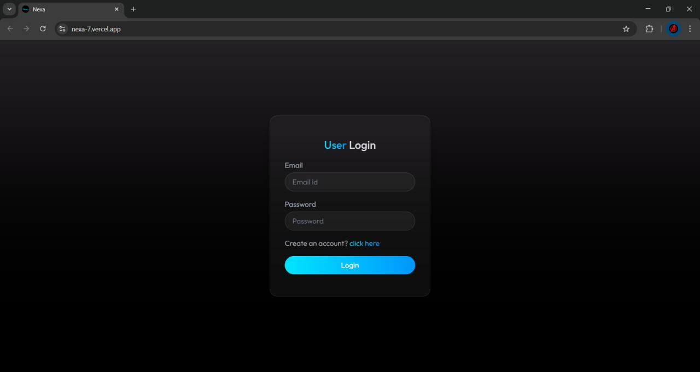

# 🚀 Nexa - Intelligent AI Assistant

Nexa is a full-stack AI-powered chatbot application that allows users to chat, generate images, and explore a community of AI-generated content.

Built using **MERN Stack + AI APIs + ImageKit**, Nexa provides a modern ChatGPT-like experience with additional features like image generation and community sharing.

---

## 🌟 Features

### 💬 AI Chat

* Real-time chatbot powered by AI
* Context-based conversations
* Chat history stored per user

### 🖼️ Image Generation

* Generate AI images using prompts
* Supports image publishing to community
* Images stored using ImageKit CDN

### 🌍 Community Feed

* View publicly shared AI-generated images
* Explore creations from other users

### 🔐 Authentication

* Secure JWT-based login/signup
* Protected routes

### 🎨 UI/UX

* Modern dark/light mode
* Responsive design
* Smooth chat experience

---

## 🛠️ Tech Stack

### Frontend

* React (Vite)
* Tailwind CSS
* Axios
* React Hot Toast

### Backend

* Node.js
* Express.js
* MongoDB (Mongoose)
* JWT Authentication

### AI & Media

* Gemini Api (AI generation)
* ImageKit (image storage & CDN)

---

## 📸 Screenshots

---

## 🚀 Future Improvements

* 🔥 Real-time streaming responses
* 🧠 Better AI memory (RAG)
* 📱 Mobile optimization
* 📤 Share chats/images

