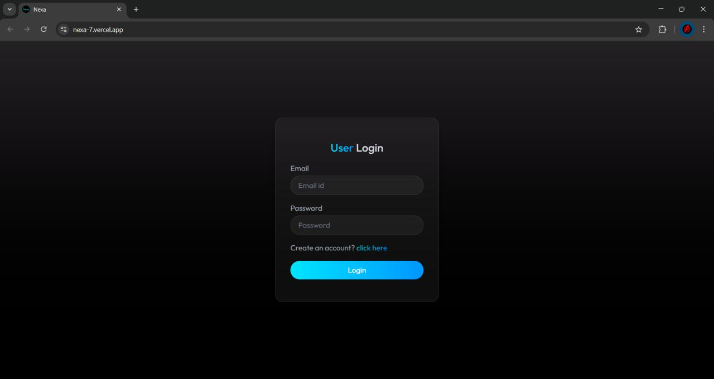

# 🚀 Nexa — Intelligent AI Assistant

<p align="center">
  
</p>

Nexa is a **full-stack AI-powered chatbot application** that lets users chat with an AI, generate stunning images from prompts, and explore a community feed of AI-generated creations.

Built with the **MERN Stack + Gemini AI + ImageKit**, Nexa delivers a modern, ChatGPT-like experience with a sleek UI and powerful backend.

---

## 📸 Screenshots

<p align="center">
  
  &nbsp;&nbsp;
  
</p>

---

## 🌟 Features

### 💬 AI Chat

- Real-time chatbot powered by **Gemini AI**
- Context-aware, multi-turn conversations
- Chat history saved per user account

### 🖼️ Image Generation

- Generate AI images using natural language prompts
- Publish images to the community with one click
- Images stored and served via **ImageKit CDN**

### 🌍 Community Feed

- Browse publicly shared AI-generated images
- Explore and get inspired by other users' creations

### 🔐 Authentication

- Secure **JWT-based** login & signup
- Password hashing with **bcrypt**
- Protected routes on both frontend and backend

### 🎨 UI/UX

- Modern dark-themed design
- Fully responsive layout
- Smooth chat experience with markdown rendering & syntax highlighting

---

## 🛠️ Tech Stack

| Layer             | Technology                             |
| ----------------- | -------------------------------------- |
| **Frontend**      | React 19 (Vite), Tailwind CSS v4       |
| **Routing**       | React Router DOM v7                    |
| **HTTP Client**   | Axios                                  |
| **Markdown**      | react-markdown, PrismJS                |
| **Notifications** | React Hot Toast                        |
| **Backend**       | Node.js, Express.js v5                 |
| **Database**      | MongoDB (Mongoose)                     |
| **Auth**          | JWT, bcryptjs                          |
| **AI**            | Gemini API (via OpenAI-compatible SDK) |
| **Media/CDN**     | ImageKit                               |

---

## 📁 Project Structure

```
Nexa/
├── client/                  # React frontend (Vite)
│   ├── src/
│   │   ├── components/      # Reusable UI components
│   │   ├── pages/           # Route pages
│   │   └── main.jsx
│   ├── public/
│   └── package.json
│
├── server/                  # Node.js backend
│   ├── configs/             # DB & ImageKit config
│   ├── controllers/         # Route logic
│   ├── middlewares/         # Auth middleware
│   ├── models/              # Mongoose schemas
│   ├── routes/              # API routes
│   ├── server.js            # Entry point
│   └── package.json
│
└── README.md
```

---

## ⚙️ Getting Started

### Prerequisites

- **Node.js** v18+
- **MongoDB** (Atlas or local)
- **Gemini API Key** — [Get one here](https://aistudio.google.com/app/apikey)
- **ImageKit account** — [Sign up here](https://imagekit.io/)

---

### 1. Clone the Repository

```bash
git clone https://github.com/Aniruddhasain7/Nexa.git
cd Nexa
```

---

### 2. Backend Setup

```bash
cd server
npm install
```

Create a `.env` file inside the `server/` directory:

```env
JWT_SECRET=your_jwt_secret_key

MONGODB_URI=mongodb+srv://<username>:<password>@cluster0.xxxxx.mongodb.net/<dbname>

GEMINI_API_KEY=your_gemini_api_key

IMAGEKIT_PUBLIC_KEY=your_imagekit_public_key
IMAGEKIT_PRIVATE_KEY=your_imagekit_private_key
IMAGEKIT_URL_ENDPOINT=https://ik.imagekit.io/your_imagekit_id
```

Start the backend server:

```bash
# Development (with hot reload)
npm run server

# Production
npm start
```

The backend runs on **http://localhost:3000** by default.

---

### 3. Frontend Setup

```bash
cd ../client
npm install
```

Create a `.env` file inside the `client/` directory:

```env
VITE_BACKEND_URL=http://localhost:3000
```

Start the frontend dev server:

```bash
npm run dev
```

The frontend runs on **http://localhost:5173** by default.

---

## 🌐 Deployment

Both `client/` and `server/` include a `vercel.json` for easy deployment on **Vercel**.

- Deploy the `server/` as a **Vercel Serverless Function**
- Deploy the `client/` as a **Vercel Static Site**
- Set all environment variables in the Vercel dashboard

---

## 🔮 Future Improvements

- 🔥 Real-time streaming AI responses
- 🧠 Better AI memory using RAG (Retrieval-Augmented Generation)
- 📱 Enhanced mobile optimization
- 📤 Share individual chats and images
