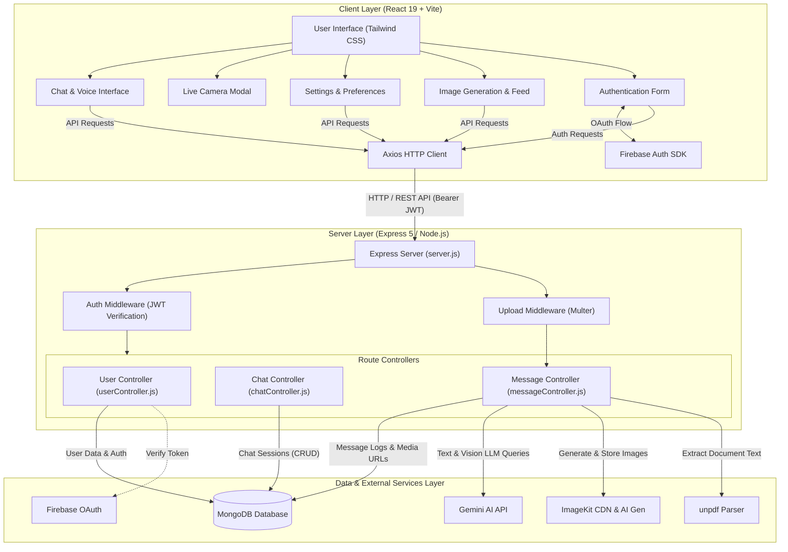

# 🚀 Nexa — Intelligent AI Assistant

<p align="center">
  
</p>

Nexa is a **full-stack AI-powered chatbot application** that enables seamless interaction with advanced AI models. Chat via text or voice, capture live camera snapshots, perform multimodal analysis on images, PDF documents, text files, and videos, generate stunning images from natural language prompts, and share your creations with a global community.

Built with the **MERN Stack** (React 19, Express.js 5, Node.js, MongoDB), **Gemini AI (Multi-Model Fallback)**, **ImageKit CDN**, and **Tailwind CSS v4**, Nexa delivers instant, natural conversations with a premium dark/light-themed UI and comprehensive user controls.

---

## 🌟 Features

### 💬 AI Chat & Generation Control
- Real-time chatbot powered by **Gemini AI** (`gemini-3.1-flash-lite`, `gemini-2.5-flash-lite`, `gemini-2.5-pro`) with automatic multi-model fallback via OpenAI-compatible SDK
- Context-aware, multi-turn conversations
- **Stop Generation Support** — Abort ongoing AI streaming/generation requests instantly with the interactive stop control
- Persistent chat session history saved securely per user account

### 📸 Live In-App Camera Capture
- **Real-Time Camera Viewfinder**: Integrated camera modal to take live photos without leaving the chat interface
- **Multi-Device Support**: Switch between front (selfie) and back (environment) cameras seamlessly
- **Mirror View Mode**: Toggle horizontal mirror flipping for natural framing
- **Self-Timer & Flash FX**: Built-in 3-second capture countdown with visual shutter flash effect
- **Instant Preview & Retake**: Inspect your snapshot and confirm or retake before submitting directly to Gemini Vision for instant multimodal analysis

### 📤 Multimodal Media & File Analysis
- 📷 **Image Analysis**: Upload images (`.jpeg`, `.png`, `.gif`, `.webp`, `.svg`) or snap live photos for visual AI context & processing via **Gemini Vision**.
- 📄 **PDF Document Analysis**: Upload **PDF (`.pdf`)** files for serverless-safe text extraction using **`unpdf`**, multi-page parsing, and AI summarization/Q&A.
- 📝 **Plain Text Documents**: Upload `.txt` files with automated context injection into AI prompts.
- 🎥 **Video File Support**: Upload videos (`.mp4`, `.webm`, `.ogg`) viewable directly in chat with media URL awareness.
- ⚡ **20 MB File Limit**: Enforced server-side in-memory upload limit via Multer middleware.

### 🖼️ AI Image Generation & Community Feed
- Generate AI images using ImageKit's dynamic AI Image Generation API
- Publish creations to the community feed with a single click
- High-performance media storage & delivery via **ImageKit CDN**

### ⚙️ User Settings & Customization Modal
- **Profile Management**: Update your display name with instant synchronization across active conversations
- **Theme Customization**: Toggle between sleek Dark Mode and clean Light Mode with persistent localStorage caching
- **Chat Behavior Controls**: Toggle automatic smooth scrolling to latest messages and customize Enter key actions (Send on Enter vs. Shift+Enter for newline)
- **Data Export & Privacy**: Export entire chat histories in formatted JSON or securely purge all chat sessions with safety confirmation modals
- **Keyboard Shortcuts Cheatsheet**: Quick reference guide for hotkeys and commands

### 🔐 Multi-Method Authentication
- Secure **JWT-based** email/password authentication
- **Google Sign-In** integration via Firebase OAuth
- Password hashing with **bcryptjs**

### 🎙️ Voice Input
- Hands-free speech-to-text prompt input using microphone integration
- Pulsing visual indicator active during speech capture
- Powered natively by the **Web Speech API** (`SpeechRecognition`)

### 🎨 Modern UI / UX
- Sleek modern design system with responsive layout for desktop and mobile devices
- Dynamic markdown output rendering with syntax highlighting via **PrismJS** and one-click code copy
- **Text / Image mode switcher** — seamlessly toggles between chat and image generation modes directly from the input bar

---

## 🏗️ System Architecture & Data Flow

Nexa follows a **3-Tier Full-Stack Architecture** separating client-side rendering, server-side API orchestration, and external AI/cloud storage infrastructure.


```mermaid
flowchart TD
    subgraph Client ["Client Layer (React 19 + Vite)"]
        direction TB
        UI["User Interface (Tailwind CSS)"]
        Chat["Chat & Voice Interface"]
        Camera["Live Camera Modal"]
        Settings["Settings & Preferences"]
        ImageGen["Image Generation & Feed"]
        Auth["Authentication Form"]
        AxiosClient["Axios HTTP Client"]
        FirebaseSDK["Firebase Auth SDK"]

        UI --> Chat
        UI --> Camera
        UI --> Settings
        UI --> ImageGen
        UI --> Auth
        Auth <-->|"OAuth Flow"| FirebaseSDK
        Chat -->|"API Requests"| AxiosClient
        Settings -->|"API Requests"| AxiosClient
        ImageGen -->|"API Requests"| AxiosClient
        Auth -->|"Auth Requests"| AxiosClient
    end

    subgraph Server ["Server Layer (Express 5 / Node.js)"]
        direction TB
        Express["Express Server (server.js)"]
        AuthMW["Auth Middleware (JWT Verification)"]
        MulterMW["Upload Middleware (Multer)"]

        subgraph RouteControllers ["Route Controllers"]
            UserCtrl["User Controller (userController.js)"]
            ChatCtrl["Chat Controller (chatController.js)"]
            MsgCtrl["Message Controller (messageController.js)"]
        end

        Express --> AuthMW
        Express --> MulterMW
        AuthMW --> RouteControllers
        MulterMW --> MsgCtrl
    end

    subgraph CloudData ["Data & External Services Layer"]
        direction TB
        MongoDB[("MongoDB Database")]
        GeminiAI["Gemini AI API"]
        ImageKit["ImageKit CDN & AI Gen"]
        FirebaseAuth["Firebase OAuth"]
        PdfParser["unpdf Parser"]
    end

    AxiosClient -->|"HTTP / REST API (Bearer JWT)"| Express

    UserCtrl -->|"User Data & Auth"| MongoDB
    UserCtrl -.->|"Verify Token"| FirebaseAuth
    ChatCtrl -->|"Chat Sessions (CRUD)"| MongoDB
    MsgCtrl -->|"Message Logs & Media URLs"| MongoDB
    MsgCtrl -->|"Text & Vision LLM Queries"| GeminiAI
    MsgCtrl -->|"Generate & Store Images"| ImageKit
    MsgCtrl -->|"Extract Document Text"| PdfParser
```

### 🎭 Component Responsibilities

| Tier                   | Component                           | Description & Responsibilities                                                                                                                                                  |
| :--------------------- | :---------------------------------- | :------------------------------------------------------------------------------------------------------------------------------------------------------------------------------ |
| **Client Layer**       | **React 19 Frontend**               | SPA built with Vite & Tailwind CSS v4. Handles user sessions, camera capture, Web Speech voice recognition, markdown rendering with syntax highlighting, and media uploads.   |
|                        | **Firebase Client SDK**             | Manages Google OAuth popups and extracts ID tokens for backend authentication.                                                                                                  |
| **Application Layer**  | **Express API Gateway**             | Central Node.js server handling route dispatching (`/api/user`, `/api/chat`, `/api/message`), CORS, and environment configuration. Compatible with Vercel serverless functions. |
|                        | **Auth Middleware (`auth.js`)**     | Validates Bearer JWT tokens on protected routes and attaches the authenticated user instance to `req.user`.                                                                     |
|                        | **Multer Middleware (`upload.js`)** | Intercepts multipart file uploads in memory (images, PDFs, text, videos) up to 20MB.                                                                                            |
|                        | **Message Controller**              | Orchestrates text LLM completions with Gemini AI, generates AI art via ImageKit, processes vision payloads, and parses PDF documents using `unpdf`.                             |
| **Data & Cloud Layer** | **MongoDB (Mongoose)**              | Stores user profile data, hashed credentials, structured chat sessions, and message logs.                                                                                       |
|                        | **Gemini AI API**                   | Generates response completions and analyzes visual/document context using Gemini models with automated multi-model fallback (`gemini-3.1-flash-lite`, `gemini-2.5-flash-lite`, `gemini-2.5-pro`). |
|                        | **ImageKit CDN**                    | Executes dynamic AI image generation prompts, stores uploaded media assets, and delivers optimized CDN media.                                                                   |
|                        | **`unpdf` Engine**                  | Serverless-safe text extraction and metadata extraction from uploaded PDF buffers without native OS dependencies.                                                               |

---

### 🔄 Detailed Technical Data Flows

#### 1. 💬 AI Text Chat Flow
1. **User** submits a prompt in the React Chat Interface.
2. **Axios Client** sends a `POST /api/message/text` request containing `chatId` and `prompt` along with the JWT `Authorization` header.
3. **Auth Middleware** verifies the JWT and attaches `req.user`.
4. **Message Controller** sends the user prompt to Gemini AI with automated model fallback (`gemini-3.1-flash-lite`, `gemini-2.5-flash-lite`, `gemini-2.5-pro`) via the OpenAI SDK wrapper.
5. **Express Backend** saves user and assistant message objects into the MongoDB `Chat` document and returns the AI reply.

#### 2. 📸 Live Camera & Multimodal Analysis Flow
1. **User** opens the Live Camera modal, frames the subject, and captures a photo (or uploads an image/PDF/text/video file).
2. **Client** attaches the image blob and sends a `POST /api/message/upload-media` request with `chatId` and optional prompt.
3. **Multer Middleware** parses the file buffer in memory and securely uploads the asset to ImageKit CDN (`nexa/uploads`).
4. **Context Processing**:
   - **Images & Camera Snaps**: Formats a vision payload array containing image URL and prompt for Gemini Vision.
   - **PDFs**: Parses `file.buffer` using `unpdf`, extracts document text, and injects up to 15,000 characters into the prompt.
   - **Text Files**: Reads UTF-8 contents directly from `file.buffer` and appends up to 10,000 characters to the prompt.
   - **Videos & Others**: Injects media URL context into the Gemini prompt.
5. **Gemini AI** processes the multimodal payload and returns a comprehensive analysis saved in MongoDB and rendered in chat.

#### 3. 🖼️ AI Image Generation Flow
1. **User** switches to Image Generation mode and inputs a descriptive prompt.
2. **Axios Client** posts to `/api/message/image`.
3. **Backend** constructs a dynamic ImageKit prompt URL (`ik-genimg-prompt-[prompt]`).
4. **Backend Server** fetches the generated image buffer, converts it to base64, and uploads it to ImageKit CDN under the `nexa/` folder.
5. **ImageKit** returns a CDN-hosted URL, which the backend saves to MongoDB and returns to the client.

---

## 🔌 API Reference

### 👤 User & Auth Routes (`/api/user`)

| Method | Endpoint                     | Auth     | Description                                            |
| :----- | :--------------------------- | :------- | :----------------------------------------------------- |
| `POST` | `/api/user/register`         | Public   | Register a new user with name, email, and password     |
| `POST` | `/api/user/login`            | Public   | Authenticate user and return JWT token                 |
| `POST` | `/api/user/google`           | Public   | Authenticate or sign up user via Firebase Google OAuth |
| `POST` | `/api/user/data`             | Required | Retrieve current authenticated user details            |
| `POST` | `/api/user/update-profile`   | Required | Update the user's display name                         |
| `POST` | `/api/user/published-images` | Public   | Fetch all community-published AI generated images      |

### 💬 Chat Routes (`/api/chat`)

| Method | Endpoint           | Auth     | Description                                            |
| :----- | :----------------- | :------- | :----------------------------------------------------- |
| `GET`  | `/api/chat/create` | Required | Create a new chat session for the logged-in user       |
| `GET`  | `/api/chat/get`    | Required | Retrieve all chat sessions for the logged-in user      |
| `POST` | `/api/chat/delete` | Required | Delete a specific chat session by `chatId`             |
| `POST` | `/api/chat/clear-all` | Required | Delete all chat conversations for the logged-in user |

### ✉️ Message Routes (`/api/message`)

| Method | Endpoint                    | Auth     | Description                                                    |
| :----- | :-------------------------- | :------- | :------------------------------------------------------------- |
| `POST` | `/api/message/text`         | Required | Send a text prompt to Gemini AI                                |
| `POST` | `/api/message/image`        | Required | Generate an AI image via ImageKit dynamic prompt               |
| `POST` | `/api/message/upload-media` | Required | Upload and analyze an image, live snapshot, PDF, text, or video |

---

## 🛠️ Tech Stack

### 🎨 Frontend

| Category             | Technology                            |
| :------------------- | :------------------------------------ |
| **Framework**        | React 19 (Vite)                       |
| **Styling**          | Tailwind CSS v4                       |
| **Routing**          | React Router DOM v7                   |
| **HTTP Client**      | Axios                                 |
| **Auth Client**      | Firebase (Google OAuth)               |
| **UI Components**    | React Hot Toast, React Icons          |
| **Markdown Parsing** | `react-markdown`, `prismjs`           |
| **Date Formatting**  | Moment.js                             |

### ⚙️ Backend

| Category                | Technology                                   |
| :---------------------- | :------------------------------------------- |
| **Runtime Environment** | Node.js (ES Modules)                         |
| **Framework**           | Express.js v5                                |
| **Database**            | MongoDB (Mongoose v9)                        |
| **Authentication**      | JSON Web Tokens (`jsonwebtoken`), `bcryptjs` |
| **File Handling**       | Multer                                       |
| **PDF Parsing**         | `unpdf` (Serverless-Safe WASM parser)        |
| **AI Integration**      | OpenAI Node SDK (pointing to Gemini API)     |
| **HTTP Client**         | Axios                                        |

### 🧠 External Integrations

| Service           | Purpose                                                                     |
| :---------------- | :-------------------------------------------------------------------------- |
| **Gemini AI API** | Multimodal LLM text completions & vision context (`gemini-3.1-flash-lite`, `gemini-2.5-flash-lite`, `gemini-2.5-pro`) |
| **ImageKit CDN**  | Dynamic AI image prompt rendering & media file storage                      |
| **Firebase Auth** | Google OAuth authentication identity verification                           |

---

## 📁 Project Structure

```
Nexa/
├── assets/                  # Application screenshots & assets
├── client/                  # React frontend (Vite)
│   ├── src/
│   │   ├── assets/          # Static UI icons & images
│   │   ├── components/      # UI components (ChatBox, Camera, Settings, Message, Sidebar)
│   │   ├── config/          # Firebase initialization
│   │   ├── context/         # React Context state management (AppContext.jsx)
│   │   ├── pages/           # Application pages (Community, Loading, Login)
│   │   ├── App.jsx          # Root component & routing
│   │   ├── index.css        # Global CSS & Tailwind styling
│   │   └── main.jsx         # Entry point
│   ├── public/
│   ├── package.json
│   ├── vercel.json          # Vercel SPA client rewrite configuration
│   └── vite.config.js
│
├── server/                  # Node.js backend
│   ├── api/
│   │   └── index.js         # Vercel serverless function entry point
│   ├── configs/             # MongoDB, ImageKit & OpenAI SDK configs
│   ├── controllers/         # userController, chatController, messageController
│   ├── middlewares/         # auth.js (JWT verify), upload.js (Multer)
│   ├── models/              # User.js, Chat.js Mongoose schemas
│   ├── routes/              # userRoutes, chatRoutes, messageRoutes
│   ├── server.js            # Express application entry point
│   ├── vercel.json          # Vercel backend rewrite configuration
│   └── package.json
│
└── README.md
```

---

## ⚙️ Getting Started

Follow these instructions to set up and run Nexa locally on your environment.

### 📋 Prerequisites

Ensure you have the following installed on your machine:

- [Node.js](https://nodejs.org/) (v18.x or higher)
- [MongoDB](https://www.mongodb.com/) (Local instance or MongoDB Atlas cluster)
- [Git](https://git-scm.com/)

---

### 🔧 Installation & Environment Setup

#### 1. Clone the Repository

```bash
git clone https://github.com/Aniruddhasain7/Nexa.git
cd Nexa
```

#### 2. Backend Setup (`server/`)

1. Navigate to the `server` directory:
   ```bash
   cd server
   ```
2. Install Node dependencies:
   ```bash
   npm install
   ```
3. Create a `.env` file inside the `server/` root directory:
   ```env
   PORT=3000
   JWT_SECRET=your_jwt_secret_here
   MONGODB_URI=your_mongodb_connection_string
   GEMINI_API_KEY=your_gemini_api_key
   IMAGEKIT_PUBLIC_KEY=your_imagekit_public_key
   IMAGEKIT_PRIVATE_KEY=your_imagekit_private_key
   IMAGEKIT_URL_ENDPOINT=your_imagekit_url_endpoint
   ```

#### 3. Frontend Setup (`client/`)

1. Navigate to the `client` directory:
   ```bash
   cd ../client
   ```
2. Install Node dependencies:
   ```bash
   npm install
   ```
3. Create a `.env` file inside the `client/` root directory:
   ```env
   VITE_SERVER_URL=http://localhost:3000
   VITE_FIREBASE_API_KEY=your_firebase_api_key
   VITE_FIREBASE_AUTH_DOMAIN=your_firebase_auth_domain
   VITE_FIREBASE_PROJECT_ID=your_firebase_project_id
   VITE_FIREBASE_STORAGE_BUCKET=your_firebase_storage_bucket
   VITE_FIREBASE_MESSAGING_SENDER_ID=your_firebase_messaging_sender_id
   VITE_FIREBASE_APP_ID=your_firebase_app_id
   ```

---

### 🏃 Running the Application Locally

#### Start Backend Server

From the `server/` directory:

```bash
# Development mode with live reload (nodemon)
npm run server

# Production mode
npm start
```

#### Start Frontend Development Server

From the `client/` directory:

```bash
# Start Vite development server
npm run dev

# Build for production
npm run build

# Preview local production build
npm run preview
```

Once running:

- Backend API listener: `http://localhost:3000`
- Frontend UI interface: `http://localhost:5173`

---

## 🔮 Future Roadmap

- ⚡ **Real-time SSE Streaming** — Server-Sent Events for word-by-word streaming AI responses
- 🧠 **RAG System** — Vector database integration (Pinecone/Chroma) for long-term document memory & retrieval
- 💬 **Social Interactions** — Likes, comments, and tags on Community Feed art
- 🔗 **Public Chat Links** — Generate shareable web links for conversation transcripts
- 📱 **Mobile App** — Native Android & iOS application using React Native
