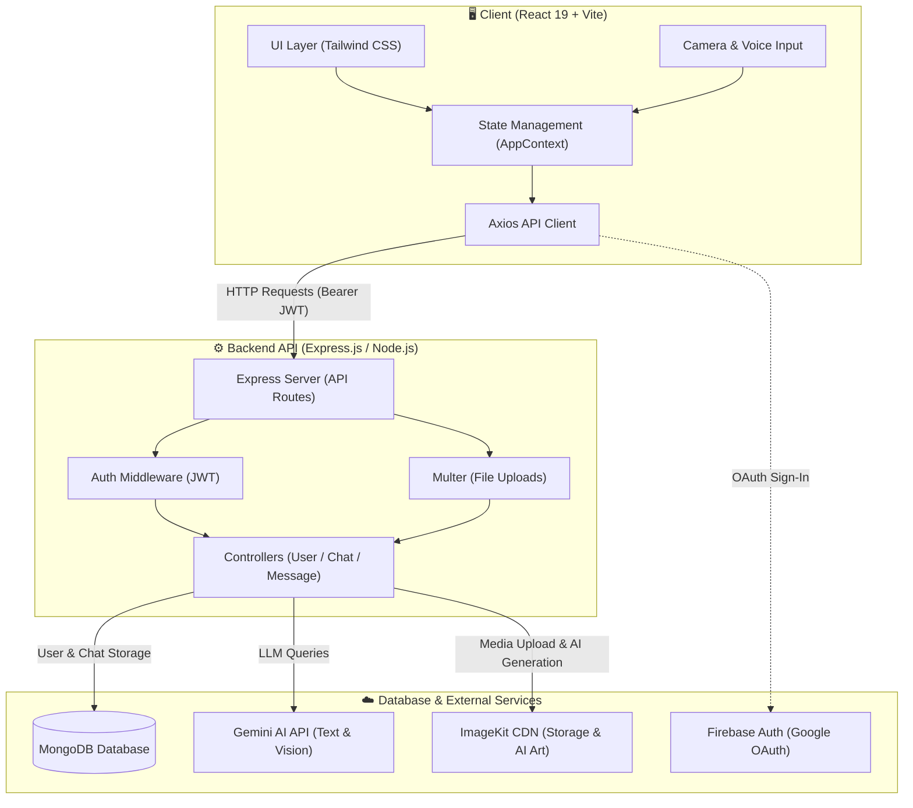

# 🚀 Nexa — Intelligent AI Assistant

<p align="center">
  
</p>

Nexa is a **full-stack AI-powered chatbot application** that enables seamless interaction with advanced AI models. Chat via text or voice, capture live camera snapshots, perform multimodal analysis on images, PDF documents, and text files, generate stunning images from natural language prompts, and share your creations with a global community.

Built with the **MERN Stack** (React 19, Express.js 5, Node.js, MongoDB), **Gemini AI (Multi-Model Fallback)**, **ImageKit CDN**, and **Tailwind CSS v4**, Nexa delivers instant, natural conversations with a premium dark/light-themed UI and comprehensive user controls.

---

## 🌟 Features

### 💬 AI Chat & Generation Control

- Real-time chatbot powered by **Gemini AI** (`gemini-3.1-flash-lite`, `gemini-2.5-flash-lite`, `gemini-2.5-pro`) with automatic multi-model fallback via OpenAI-compatible SDK
- Context-aware, multi-turn conversations
- Persistent chat session history saved securely per user account

### 📸 Live In-App Camera Capture

- **Multi-Device Support**: Switch between front (selfie) and back (environment) cameras seamlessly
- **Instant Preview & Retake**: Inspect your snapshot and confirm or retake before submitting directly to Gemini Vision for instant multimodal analysis

### 📤 Multimodal Media & Document Analysis

- 📷 **Image Analysis**: Upload images (`.jpeg`, `.png`, `.gif`, `.webp`, `.svg`) or snap live photos for visual AI context & processing via **Gemini Vision**.
- 📄 **PDF Document Analysis**: Upload **PDF (`.pdf`)** files for serverless-safe text extraction using **`unpdf`**, multi-page parsing, and AI summarization/Q&A.
- 📝 **Plain Text Documents**: Upload `.txt` files with automated context injection into AI prompts.

### 🖼️ AI Image Generation & Community Feed

- Generate AI images using ImageKit's dynamic AI Image Generation API
- Publish creations to the community feed with a single click
- High-performance media storage & delivery via **ImageKit CDN**

### ⚙️ User Settings & Customization Modal

- **Profile Management**: Update your display name with instant synchronization across active conversations
- **Theme Customization**: Toggle between sleek Dark Mode and clean Light Mode with persistent localStorage caching
- **Data Export & Privacy**: Export entire chat histories in formatted JSON or securely purge all chat sessions with safety confirmation modals

### 🔐 Multi-Method Authentication

- Secure **JWT-based** email/password authentication
- **Google Sign-In** integration via Firebase OAuth

### 🎙️ Voice Input

- Hands-free speech-to-text prompt input using microphone integration
- Powered natively by the **Web Speech API** (`SpeechRecognition`)

### 🎨 Modern UI / UX

- Sleek modern design system with responsive layout for desktop and mobile devices
- Dynamic markdown output rendering with syntax highlighting via **PrismJS** and one-click code copy
- **Text / Image mode switcher** — seamlessly toggles between chat and image generation modes directly from the input bar

---

## 🏗️ System Architecture & Data Flow

Nexa is built on a **3-Tier Full-Stack Architecture**, neatly organizing the client interface, API backend, and cloud/AI services.


```mermaid
flowchart TB
    subgraph Client ["🖥️ Client (React 19 + Vite)"]
        UI["UI Layer (Tailwind CSS)"]
        State["State Management (AppContext)"]
        MediaInput["Camera & Voice Input"]
        AxiosClient["Axios API Client"]

        UI --> State
        MediaInput --> State
        State --> AxiosClient
    end

    subgraph Server ["⚙️ Backend API (Express.js / Node.js)"]
        API["Express Server (API Routes)"]
        AuthMW["Auth Middleware (JWT)"]
        MulterMW["Multer (File Uploads)"]
        Controllers["Controllers (User / Chat / Message)"]

        API --> AuthMW
        API --> MulterMW
        AuthMW --> Controllers
        MulterMW --> Controllers
    end

    subgraph Services ["☁️ Database & External Services"]
        MongoDB[("MongoDB Database")]
        Gemini["Gemini AI API (Text & Vision)"]
        ImageKit["ImageKit CDN (Storage & AI Art)"]
        Firebase["Firebase Auth (Google OAuth)"]
    end

    AxiosClient -->|"HTTP Requests (Bearer JWT)"| API
    Controllers -->|"User & Chat Storage"| MongoDB
    Controllers -->|"LLM Queries"| Gemini
    Controllers -->|"Media Upload & AI Generation"| ImageKit
    AxiosClient -.->|"OAuth Sign-In"| Firebase
```

### 🧱 Component Breakdown

| Layer               | Component                 | Key Technologies                   | Function                                                                                          |
| :------------------ | :------------------------ | :--------------------------------- | :------------------------------------------------------------------------------------------------ |
| **Frontend**        | **UI & Chat Interface**   | React 19, Tailwind CSS v4, PrismJS | Responsive chat interface, live camera viewfinder, voice recognition, dynamic markdown rendering  |
|                     | **State & Network**       | React Context, Axios, Firebase SDK | Global authentication state, chat session management, OAuth popups, secure API communication      |
| **Backend**         | **API Gateway & Routing** | Express.js v5, Node.js             | RESTful endpoints (`/api/user`, `/api/chat`, `/api/message`), CORS, serverless compatibility      |
|                     | **Middlewares & Parsing** | JWT, Multer, `unpdf`               | Request authentication, in-memory file parsing (images, PDFs, text), text extraction              |
|                     | **Controllers**           | User, Chat, Message Controllers    | Business logic orchestration, AI prompt formatting, chat history CRUD, image generation workflows |
| **Data & Services** | **Database**              | MongoDB & Mongoose                 | Persisting user credentials, chat sessions, and message logs                                      |
|                     | **AI Engine**             | Gemini AI (OpenAI Node SDK)        | Text completions, multi-turn context, and multimodal vision processing with model fallback        |
|                     | **Media & CDN**           | ImageKit CDN                       | Dynamic AI image synthesis, media asset hosting, and image optimization                           |

---

### 🔄 Core Data Flows

#### 1. 💬 AI Chat Flow (Text & Voice)

1. **Prompt Submission**: User enters a text message or speaks via the Web Speech API.
2. **API Request**: Axios sends a `POST /api/message/text` request with the chat ID and JWT `Authorization` header.
3. **Auth & Processing**: JWT middleware authenticates the user, and the message controller forwards the prompt to **Gemini AI** (with multi-model fallback: `gemini-3.1-flash-lite` → `gemini-2.5-flash-lite` → `gemini-2.5-pro`).
4. **Storage & Reply**: Express saves user and assistant messages in **MongoDB** and returns the AI reply for formatted markdown rendering.

#### 2. 📸 Multimodal & Document Analysis Flow

1. **Capture / Upload**: User snaps a live camera photo or uploads a document (PDF, Image, or Text file).
2. **Buffer & Text Extraction**: Multer handles the file in memory. The backend uploads the asset to **ImageKit CDN** and extracts document text (using `unpdf` for PDFs or UTF-8 parsing for text files).
3. **Vision Processing**: The contextual payload (extracted text / image URL + prompt) is sent to **Gemini Vision**.
4. **Result**: AI analysis is saved into the chat history in **MongoDB** and rendered in real time.

#### 3. 🖼️ AI Image Generation & Community Feed Flow

1. **Image Prompt**: User switches to Image Mode and submits a visual description.
2. **Synthesis**: The backend requests image creation through **ImageKit's dynamic AI engine**.
3. **Delivery**: ImageKit generates and hosts the image on its CDN, returning the URL to be saved in **MongoDB**.
4. **Community Sharing**: The user can view the artwork in chat and optionally publish it to the global **Community Feed** with a single click.

---

## 🔌 API Reference

### 👤 User & Auth Routes (`/api/user`)

| Method | Endpoint                     | Auth     | Description                                            |
| :----- | :--------------------------- | :------- | :----------------------------------------------------- |
| `POST` | `/api/user/register`         | Public   | Register a new user with name, email, and password     |
| `POST` | `/api/user/login`            | Public   | Authenticate user and return JWT token                 |
| `POST` | `/api/user/google`           | Public   | Authenticate or sign up user via Firebase Google OAuth |
| `POST` | `/api/user/data`             | Required | Retrieve current authenticated user details            |
| `POST` | `/api/user/update-profile`   | Required | Update the user's display name                         |
| `POST` | `/api/user/published-images` | Public   | Fetch all community-published AI generated images      |

### 💬 Chat Routes (`/api/chat`)

| Method | Endpoint              | Auth     | Description                                          |
| :----- | :-------------------- | :------- | :--------------------------------------------------- |
| `GET`  | `/api/chat/create`    | Required | Create a new chat session for the logged-in user     |
| `GET`  | `/api/chat/get`       | Required | Retrieve all chat sessions for the logged-in user    |
| `POST` | `/api/chat/delete`    | Required | Delete a specific chat session by `chatId`           |
| `POST` | `/api/chat/clear-all` | Required | Delete all chat conversations for the logged-in user |

### ✉️ Message Routes (`/api/message`)

| Method | Endpoint                    | Auth     | Description                                                   |
| :----- | :-------------------------- | :------- | :------------------------------------------------------------ |
| `POST` | `/api/message/text`         | Required | Send a text prompt to Gemini AI                               |
| `POST` | `/api/message/image`        | Required | Generate an AI image via ImageKit dynamic prompt              |
| `POST` | `/api/message/upload-media` | Required | Upload and analyze an image, live snapshot, PDF, or text file |

---

## 🛠️ Tech Stack

### 🎨 Frontend

| Category             | Technology                   |
| :------------------- | :--------------------------- |
| **Framework**        | React 19 (Vite)              |
| **Styling**          | Tailwind CSS v4              |
| **Routing**          | React Router DOM v7          |
| **HTTP Client**      | Axios                        |
| **Auth Client**      | Firebase (Google OAuth)      |
| **UI Components**    | React Hot Toast, React Icons |
| **Markdown Parsing** | `react-markdown`, `prismjs`  |
| **Date Formatting**  | Moment.js                    |

### ⚙️ Backend

| Category                | Technology                                   |
| :---------------------- | :------------------------------------------- |
| **Runtime Environment** | Node.js (ES Modules)                         |
| **Framework**           | Express.js v5                                |
| **Database**            | MongoDB (Mongoose v9)                        |
| **Authentication**      | JSON Web Tokens (`jsonwebtoken`), `bcryptjs` |
| **File Handling**       | Multer                                       |
| **PDF Parsing**         | `unpdf` (Serverless-Safe WASM parser)        |
| **AI Integration**      | OpenAI Node SDK (pointing to Gemini API)     |
| **HTTP Client**         | Axios                                        |

### 🧠 External Integrations

| Service           | Purpose                                                                                                               |
| :---------------- | :-------------------------------------------------------------------------------------------------------------------- |
| **Gemini AI API** | Multimodal LLM text completions & vision context (`gemini-3.1-flash-lite`, `gemini-2.5-flash-lite`, `gemini-2.5-pro`) |
| **ImageKit CDN**  | Dynamic AI image prompt rendering & media file storage                                                                |
| **Firebase Auth** | Google OAuth authentication identity verification                                                                     |

---

## 📁 Project Structure

```
Nexa/
├── assets/                  # Application screenshots & assets
├── client/                  # React frontend (Vite)
│   ├── src/
│   │   ├── assets/          # Static UI icons & images
│   │   ├── components/      # UI components (ChatBox, Camera, Settings, Message, Sidebar)
│   │   ├── config/          # Firebase initialization
│   │   ├── context/         # React Context state management (AppContext.jsx)
│   │   ├── pages/           # Application pages (Community, Loading, Login)
│   │   ├── App.jsx          # Root component & routing
│   │   ├── index.css        # Global CSS & Tailwind styling
│   │   └── main.jsx         # Entry point
│   ├── public/
│   ├── package.json
│   ├── vercel.json          # Vercel SPA client rewrite configuration
│   └── vite.config.js
│
├── server/                  # Node.js backend
│   ├── api/
│   │   └── index.js         # Vercel serverless function entry point
│   ├── configs/             # MongoDB, ImageKit & OpenAI SDK configs
│   ├── controllers/         # userController, chatController, messageController
│   ├── middlewares/         # auth.js (JWT verify), upload.js (Multer)
│   ├── models/              # User.js, Chat.js Mongoose schemas
│   ├── routes/              # userRoutes, chatRoutes, messageRoutes
│   ├── server.js            # Express application entry point
│   ├── vercel.json          # Vercel backend rewrite configuration
│   └── package.json
│
└── README.md
```

---

## ⚙️ Getting Started

Follow these instructions to set up and run Nexa locally on your environment.

### 📋 Prerequisites

Ensure you have the following installed on your machine:

- [Node.js](https://nodejs.org/) (v18.x or higher)
- [MongoDB](https://www.mongodb.com/) (Local instance or MongoDB Atlas cluster)
- [Git](https://git-scm.com/)

---

### 🔧 Installation & Environment Setup

#### 1. Clone the Repository

```bash
git clone https://github.com/Aniruddhasain7/Nexa.git
cd Nexa
```

#### 2. Backend Setup (`server/`)

1. Navigate to the `server` directory:
   ```bash
   cd server
   ```
2. Install Node dependencies:
   ```bash
   npm install
   ```
3. Create a `.env` file inside the `server/` root directory:
   ```env
   PORT=3000
   JWT_SECRET=your_jwt_secret_here
   MONGODB_URI=your_mongodb_connection_string
   GEMINI_API_KEY=your_gemini_api_key
   IMAGEKIT_PUBLIC_KEY=your_imagekit_public_key
   IMAGEKIT_PRIVATE_KEY=your_imagekit_private_key
   IMAGEKIT_URL_ENDPOINT=your_imagekit_url_endpoint
   ```

#### 3. Frontend Setup (`client/`)

1. Navigate to the `client` directory:
   ```bash
   cd ../client
   ```
2. Install Node dependencies:
   ```bash
   npm install
   ```
3. Create a `.env` file inside the `client/` root directory:
   ```env
   VITE_SERVER_URL=http://localhost:3000
   VITE_FIREBASE_API_KEY=your_firebase_api_key
   VITE_FIREBASE_AUTH_DOMAIN=your_firebase_auth_domain
   VITE_FIREBASE_PROJECT_ID=your_firebase_project_id
   VITE_FIREBASE_STORAGE_BUCKET=your_firebase_storage_bucket
   VITE_FIREBASE_MESSAGING_SENDER_ID=your_firebase_messaging_sender_id
   VITE_FIREBASE_APP_ID=your_firebase_app_id
   ```

---

### 🏃 Running the Application Locally

#### Start Backend Server

From the `server/` directory:

```bash
# Development mode with live reload (nodemon)
npm run server

# Production mode
npm start
```

#### Start Frontend Development Server

From the `client/` directory:

```bash
# Start Vite development server
npm run dev

# Build for production
npm run build

# Preview local production build
npm run preview
```

Once running:

- Backend API listener: `http://localhost:3000`
- Frontend UI interface: `http://localhost:5173`

---

## 🔮 Future Roadmap

- ⚡ **Real-time SSE Streaming** — Server-Sent Events for word-by-word streaming AI responses
- 🧠 **RAG System** — Vector database integration (Pinecone/Chroma) for long-term document memory & retrieval
- 💬 **Social Interactions** — Likes, comments, and tags on Community Feed art
- 🔗 **Public Chat Links** — Generate shareable web links for conversation transcripts
- 📱 **Mobile App** — Native Android & iOS application using React Native
