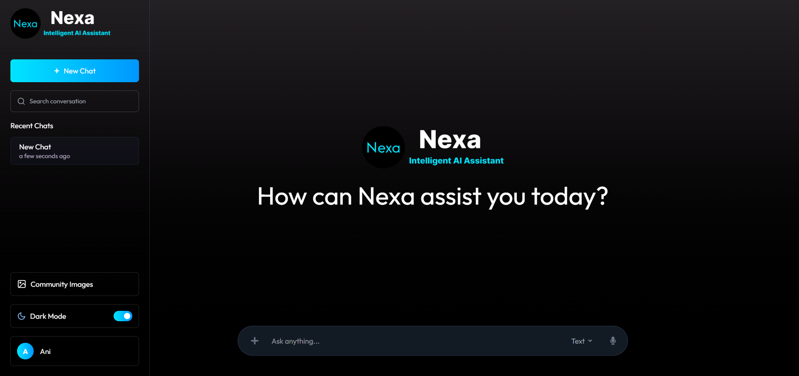
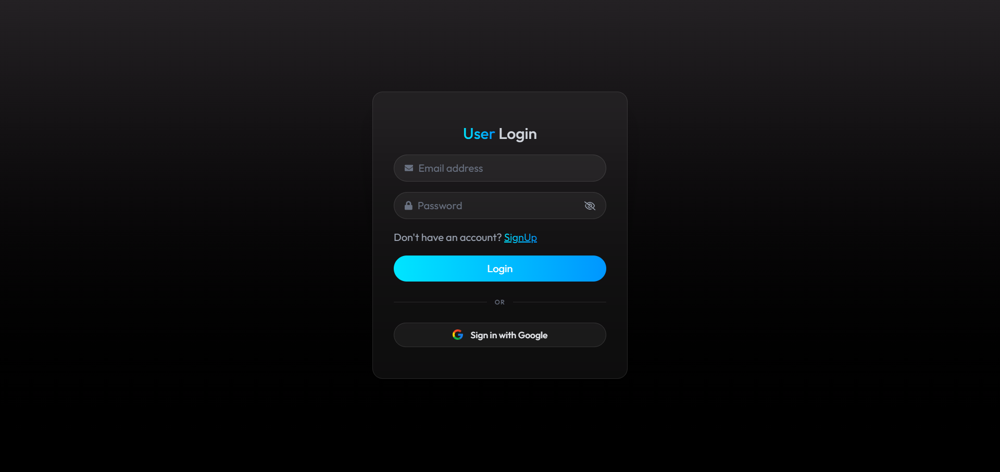
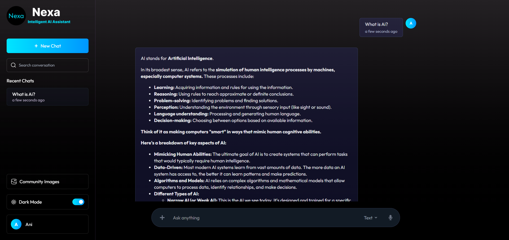
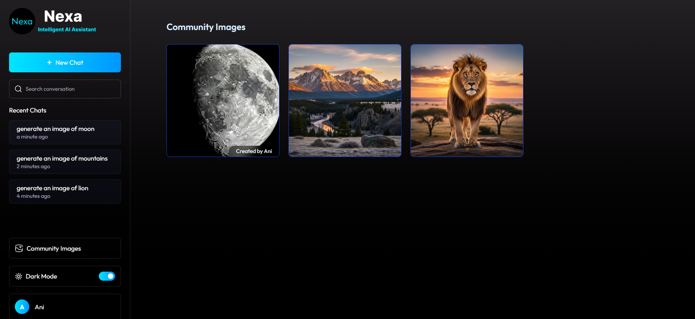
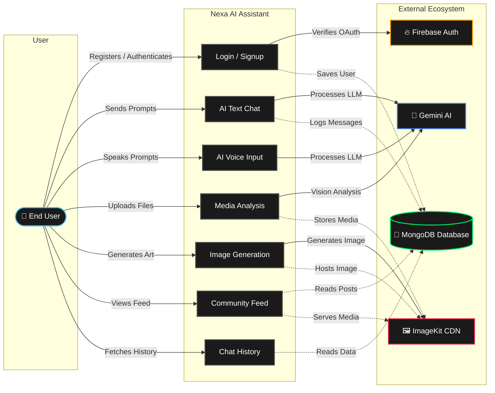

# 🚀 Nexa — Intelligent AI Assistant

<p align="center">
  
</p>

Nexa is a **full-stack AI-powered chatbot application** that enables seamless interaction with advanced AI models. Chat via text or voice, generate stunning images from natural language prompts, and share your creations with a global community.

Built with the **MERN Stack**, **Gemini AI**, and **ImageKit**, Nexa delivers a lightning-fast, ChatGPT-like experience with a premium dark-themed UI.

---

## 🖥️ App Preview

|                            Login                            |                         Home                          |
| :---------------------------------------------------------: | :---------------------------------------------------: |
|  |  |

|                         Chat                          |                         Community                          |
| :---------------------------------------------------: | :--------------------------------------------------------: |
|  |  |

---

## 🌟 Features

### 💬 AI Chat

- Real-time chatbot powered by **Gemini AI**
- Context-aware, multi-turn conversations
- Chat history saved per user account

### 🖼️ Image Generation

- Generate AI images using ImageKit's dynamic AI Image Generation API
- Publish images to the community with one click
- Images stored and served via **ImageKit CDN**

### 🌍 Community Feed

- Browse publicly shared AI-generated images
- Explore and get inspired by other user's creations

### 🔐 Authentication

- Secure **JWT-based** login & signup
- **Google Sign-In** via Firebase OAuth
- Password hashing with **bcrypt**

### 🎙️ Voice Input

- Speak your prompts with a single click using the microphone button
- Pulsing animated UI indicator while active
- Powered by the **Web Speech API** (SpeechRecognition)

### 📤 Media Upload & AI Analysis

- **Image Analysis**: Upload images (JPEG, PNG, GIF, WebP, SVG) for AI to analyze using **Gemini Vision**.
- **Document Analysis**: Upload **Plain Text (.txt)** files sent as context to the AI.
- **Video Support**: Upload videos (MP4, WebM, OGG) viewable directly in the chat.
- **File Size Limit**: Max **20 MB** per upload, enforced on both client and server.

### 🎨 UI/UX

- Modern dark-themed design with light mode support
- Fully responsive layout for desktop & mobile
- Smooth chat experience with markdown rendering & syntax highlighting
- **Text / Image mode switcher** — switch between chat and image generation from the input bar

---

## 🔗 Architecture & Flow Diagram

The following diagram illustrates how different actors — **Users** and **Guests** — interact with **Nexa**'s core features, and how those features connect to external services (Gemini AI, ImageKit, Firebase & MongoDB).


```mermaid
flowchart LR
    subgraph Actors ["User"]
        direction TB
        User(["🧍 End User"])
    end

    %% ── Column 2: Nexa Platform ──────────────────────────
    subgraph Platform ["Nexa AI Assistant"]
        direction TB
        UC_Auth["Login / Signup"]
        UC_Chat["AI Text Chat"]
        UC_Voice["AI Voice Input"]
        UC_Upload["Media Analysis"]
        UC_Gen["Image Generation"]
        UC_Feed["Community Feed"]
        UC_History["Chat History"]
    end

    %% ── Column 3: Storage & services ──────────────────────
    subgraph Services ["External Ecosystem"]
        direction TB
        Firebase["🔥 Firebase Auth"]
        Gemini["🧠 Gemini AI"]
        ImageKit["🖼️ ImageKit CDN"]
        DB[("🍃 MongoDB Database")]
    end

    User -->|"Registers / Authenticates"| UC_Auth
    User -->|"Sends Prompts"| UC_Chat
    User -->|"Speaks Prompts"| UC_Voice
    User -->|"Uploads Files"| UC_Upload
    User -->|"Generates Art"| UC_Gen
    User -->|"Views Feed"| UC_Feed
    User -->|"Fetches History"| UC_History

    %% ── Connections: Platform -> Services ────────────────
    UC_Auth   -->|"Verifies OAuth"| Firebase
    UC_Auth   -.->|"Saves User"| DB
    UC_Chat   -->|"Processes LLM"| Gemini
    UC_Chat   -.->|"Logs Messages"| DB
    UC_Voice  -->|"Processes LLM"| Gemini
    UC_Upload -->|"Vision Analysis"| Gemini
    UC_Upload -.->|"Stores Media"| ImageKit
    UC_Gen    -->|"Generates Image"| ImageKit
    UC_Gen    -.->|"Hosts Image"| ImageKit
    UC_Feed   -.->|"Reads Posts"| DB
    UC_Feed   -.->|"Serves Media"| ImageKit
    UC_History -.->|"Reads Data"| DB

    %% ── Styles ──────────────────────────────────────────
    classDef actor fill:#1a1a1a,stroke:#38bdf8,stroke-width:2px,color:#fff
    classDef platform fill:#1a1a1a,stroke:#4a4a4e,stroke-width:2px,color:#fff
    classDef firebase fill:#1a1a1a,stroke:#ffa000,stroke-width:2px,color:#fff
    classDef gemini fill:#1a1a1a,stroke:#3b82f6,stroke-width:2px,color:#fff
    classDef imagekit fill:#1a1a1a,stroke:#e11d48,stroke-width:2px,color:#fff
    classDef mongodb fill:#1a1a1a,stroke:#00ed64,stroke-width:2px,color:#fff

    class User actor
    class UC_Auth,UC_Chat,UC_Voice,UC_Upload,UC_Gen,UC_Feed,UC_History platform
    class Firebase firebase
    class Gemini gemini
    class ImageKit imagekit
    class DB mongodb
```

### 🎭 Actors & Systems

| Actor / System       | Role                                                                                           |
| :------------------- | :--------------------------------------------------------------------------------------------- |
| **🧍 End User**      | A registered user with full access to chat, image generation, history, and community features. |
| **🧠 Gemini AI**     | Google's LLM powering text chat, voice responses, and multimedia/vision analysis.              |
| **🖼️ ImageKit CDN**  | Cloud media service powering dynamic AI image generation, as well as storing/serving media.    |
| **🔥 Firebase Auth** | Handles Google OAuth sign-in flow, returning a verified identity token to the backend.         |
| **🍃 MongoDB**       | Primary database storing user accounts, hashed passwords, chat histories, and community posts. |

---

## 🛠️ Tech Stack

### 🎨 Frontend

| Category          | Technology                   |
| :---------------- | :--------------------------- |
| **Framework**     | React 19 (Vite)              |
| **Styling**       | Tailwind CSS v4              |
| **Routing**       | React Router DOM v7          |
| **HTTP Client**   | Axios                        |
| **Auth**          | Firebase (Google OAuth)      |
| **UI Components** | React Hot Toast, React Icons |
| **Markdown**      | react-markdown, PrismJS      |
| **Utilities**     | Moment.js                    |

### ⚙️ Backend

| Category          | Technology         |
| :---------------- | :----------------- |
| **Runtime**       | Node.js            |
| **Framework**     | Express.js v5      |
| **Database**      | MongoDB (Mongoose) |
| **Auth**          | JWT, bcryptjs      |
| **File Handling** | Multer             |
| **HTTP Client**   | Axios              |

### 🧠 Integrations

| Service       | Technology             |
| :------------ | :--------------------- |
| **AI Engine** | Gemini AI API (Google) |
| **Media/CDN** | ImageKit               |
| **Auth**      | Firebase (Google Auth) |

---

## 📁 Project Structure

```
Nexa/
├── client/                  # React frontend (Vite)
│   ├── src/
│   │   ├── components/      # Reusable UI components
│   │   ├── config/          # Firebase config
│   │   ├── context/         # Global app context
│   │   ├── pages/           # Route pages
│   │   └── main.jsx
│   ├── public/
│   └── package.json
│
├── server/                  # Node.js backend
│   ├── configs/             # DB, ImageKit & OpenAI config
│   ├── controllers/         # Route logic
│   ├── middlewares/         # Auth & upload middleware
│   ├── models/              # Mongoose schemas
│   ├── routes/              # API routes
│   ├── server.js            # Entry point
│   └── package.json
│
└── README.md
```

---

## 🔮 Future Roadmap

- [ ] **Real-time Streaming** — Server-Sent Events (SSE) for live AI response streaming
- [ ] **RAG Integration** — Knowledge-based AI memory using Retrieval-Augmented Generation
- [ ] **Social Features** — Comment and like creations in the Community Feed
- [ ] **Share Chats** — Share individual conversations via public links
- [ ] **Mobile App** — Dedicated mobile application using React Native

---

<p align="center">Made with ❤️ by Aniruddha</p>
