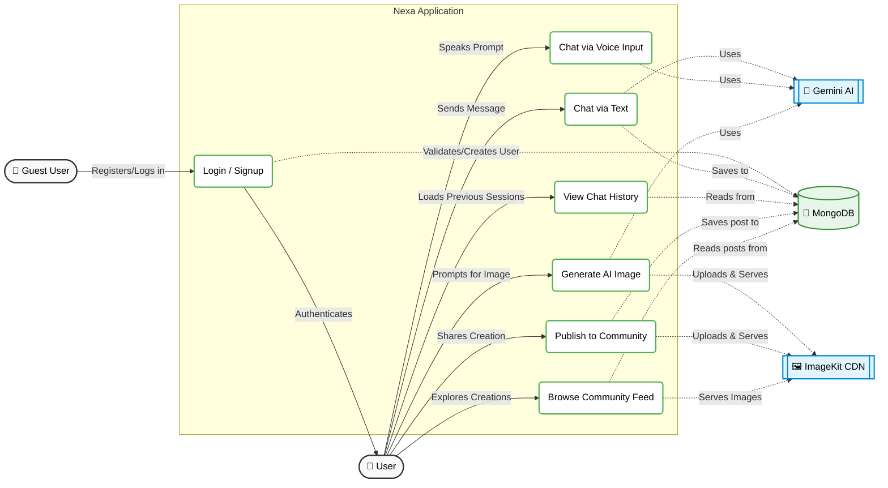

# Nexa AI Assistant - Use Case Diagram

Here is a comprehensive Use Case Diagram for the Nexa Application, detailing the interactions between the User, the system's core features, and its external integrations (Gemini AI & ImageKit).

## Description of Actors & Systems
* **User**: An authenticated user of the application navigating their personal chats and creations.
* **Guest User**: An unauthenticated user whose primary capability is signing up or logging in.
* **Gemini AI**: Google's LLM responsible for intelligent chat replies and generating images based on textual prompts.
* **ImageKit CDN**: The external media host responsible for storing AI-generated assets and serving them efficiently on the community feed.
* **MongoDB**: The primary database storing user profiles, hashed passwords, chat histories, and community image metadata.
